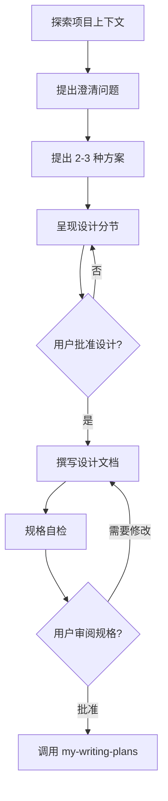

# 头脑风暴：将创意头脑风暴转化为设计

通过自然的协作对话，帮助把想法完善为完整的设计与规格。

只有当用户明确调用 `my-brainstorming` 才启用。

首先了解当前项目上下文，然后逐次提问以细化想法。一旦理解了要构建的内容，就呈现设计并获取用户批准。

<HARD-GATE>
在呈现设计并获得用户批准之前，不要调用任何实现类 skill、编写代码、搭建项目或执行任何实现操作。
</HARD-GATE>

## 检查清单

你必须为以下每一项创建任务并按顺序完成：

1. **探索项目上下文** — 检查文件、文档、近期commit
2. **提出澄清问题** — 一次一个，理解目的/约束/成功标准
3. **提出 2-3 种方案** — 附带权衡分析与你的推荐
4. **呈现设计** — 按复杂程度分节展示，每节结束后获得用户批准
5. **撰写设计文档** — 保存到 `docs/superpowers/specs/YYYY-MM-DD-<topic>-design.md`
6. **规格自检** — 快速检查占位符、矛盾、歧义、范围（见下文）
7. **用户审阅书面规格** — 在继续之前请用户审查规格文件
8. **进入实现阶段** — 调用 my-writing-plans skill 创建实现计划

## 流程图

**终止状态是调用 my-writing-plans。** 不要调用任何实现类 skill。头脑风暴之后唯一可调用的 skill 是 my-writing-plans。

## 流程

**理解想法：**

- 首先查看当前项目状态（文件、文档、最近的 commit）
- 在提出详细问题之前，先评估范围：如果需求描述了多个独立子系统（例如"构建一个包含聊天、文件存储、计费和分析的平台"），立即指出这一点。不要花时间用问题去细化一个需要先拆分的项目。
- 如果项目规模过大，单个规格说明无法覆盖，帮助用户分解为子项目：有哪些独立的部分，它们之间有什么关系，应该按什么顺序构建？然后通过正常的设计流程进行第一个子项目的头脑风暴。每个子项目都有自己的规格 → 计划 → 实现周期。
- 对于范围适当的项目，每次提一个问题来完善想法
- 尽量使用选择题，开放式问题也可以
- 每条消息只提一个问题——如果一个主题需要更多探索，拆分成多个问题
- 重点理解：目的、约束、成功标准

**探索方案：**

- 提出 2-3 种不同方案并说明权衡
- 以对话方式呈现选项，给出你的推荐及理由
- 先给出推荐选项并解释原因

**呈现设计：**

- 一旦你认为理解了要构建的内容，就展示设计
- 每个部分的篇幅与其复杂度匹配：简单的几句话，复杂的最多 200-300 字
- 每个部分展示后询问是否正确
- 涵盖：架构、组件、数据流、错误处理、测试
- 随时准备回头澄清不明确的地方

**面向隔离和清晰的设计：**

- 将系统拆分为更小的单元，每个单元职责单一，通过定义良好的接口通信，并能独立理解和测试
- 对每个单元，你都应该能回答：它做什么、如何使用、依赖什么？
- 别人能否在不阅读内部实现的情况下理解一个单元的功能？你能否在不破坏调用方的前提下修改其内部？如果不行，边界就需要调整。
- 更小、边界清晰的单元也更容易处理——你能更好地一次性理解整段代码，编辑文件时也更可靠。当文件过大时，往往说明它承担了太多职责。

**在现有代码库中工作：**

- 在提出改动前先探索现有结构。遵循现有模式。
- 如果现有代码存在影响当前工作的问题（例如文件过大、边界不清、职责缠绕），将针对性改进纳入设计——就像优秀的开发者在日常工作中改进代码一样。
- 不要提议无关重构。聚焦于服务当前目标的事项。

## 设计完成后

**文档：**

- 将已确认的设计（规格）写入 `docs/superpowers/specs/YYYY-MM-DD-<topic>-design.md`
  - （用户对规格位置的偏好优先于此默认路径）

**规格自检：**
写完规格文档后，以全新的眼光审视：

1. **占位符扫描：** 有没有"待定"、"TODO"、未完成的章节或模糊的需求？修复它们。
2. **内部一致性：** 各章节之间有矛盾吗？架构和功能描述匹配吗？
3. **范围检查：** 这是否聚焦到可以用一个实现计划覆盖，还是需要进一步拆分？
4. **模糊性检查：** 有没有需求可以被两种方式理解？如果有，选择一种并明确写出来。

发现问题就直接内联修复。无需重新审查——修好继续推进。

**用户审阅关卡：**
规格审阅循环通过后，请求用户在继续前审阅书面规格：

> "规格已保存到 `<path>`。请在开始制定实现计划前审阅，如需修改请告诉我。"

等待用户回复。如果他们要求修改，进行修改并重新运行规格审阅循环。只有在用户批准后才能继续。

**实现：**

- 调用 my-writing-plans skill 创建详细实现计划
- 不要调用任何其他 skill。下一步就是  my-writing-plans。

## 核心原则

- **一次只问一个问题** — 不要一次性抛出多个问题
- **优先使用选择题** — 在可能的情况下比开放式问题更容易回答
- **严格执行 YAGNI** — 从所有设计中剔除不必要的功能
- **探索替代方案** — 在确定前始终提出 2-3 种方案
- **增量验证** — 先呈现设计，获得批准后再继续
- **保持灵活** — 当某处不合理时返回并澄清
